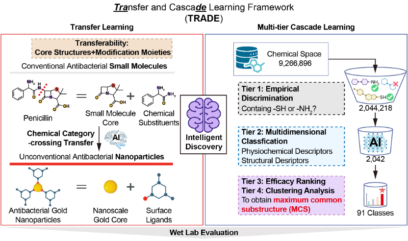

# TRADE: Funnel-like model for Gold Nano-particle Discovery

[](https://badge.fury.io/py/synthemol)
[](https://badge.fury.io/py/synthemol)
[](https://github.com/swansonk14/SyntheMol/blob/main/LICENSE.txt)

TRADE is a model that can filter out some unlikely molecules to become the ligands of antibiotic nano-particles.

TRADE connects several machine learning models that filter molecules like a funnel, including traditional machine learning, graph-based neural networks, and molecular fingerprint-based neural networks. It is used to search for possible ligands in the small molecule database, and cluster similar molecules with their largest substructures, which are used for subsequent wet experiments.


## Table of contents

* [Installation](#Installation)
* [Data collection and pre-processing](#Data-collection-and-pre-processing)
* [Select and save the model](#Select-and-save-the-model)
  + [Training and evaluation](#Training-and-evaluation)
* [Screening the ligands on the chemical space](#Screening-the-ligands-on-the-chemical-space)
* [Analysing the results](#Analysing-the-results)
* 

## Installation

TRADE can be easily installed and run in personal computer (searching space are around 7,000,000 molecules)

Optionally, create a conda environment.
```bash
conda create -y -n synthemol python=3.10
conda activate synthemol
```

Install SyntheMol via pip.
```bash
pip install funcsrmol
```

If there are version issues with the required packages, create a conda environment with specific working versions of the packages as follows.
```bash
pip install -r requirements.txt
pip install -e .
```

## Data collection and pre-processing

TRADE was designed to use all the gold nano-particle data in the paper to train the model, and we also supplemented some of the compound ligands that were already available in wet experiments in our lab. For the search space, we use the ZINC database for molecules labeled as similar to drugs, which contains 6,889,178 molecules.

**Data collection:** Replace `data/data_url.csv` in the `scripts` folder with a custom file containing the uniform resource locator (url) of the search space of data. In our case, the file contained the url data of molecules with the tap of Drug-like and In-stock, which is download on https://zinc15.docking.org. The file should be a csv file without header row.

```bash
python scripts/data_processing/data_collecting.py \
    --url_file trade/Data/Download_data/data_url.txt \
    --delimiter '\t'
```

**Data pre-processing:** After collecting the simplest data, the smiles format of a molecules, we need to compute important physico-chemical descriptors for each molecule to extend the data. In `TRADE/scripts/data_extender.py`, we used RDKit to extend the data and save the data in `Data/Original_space`.
```bash
python scripts/data_processing/data_pruning.py 
```

```bash
python scripts/data_processing/data_cleaning.py 
```

Pre-processing the data of training set.
```bash
python scripts/data_processing/data_extender.py \
    --save_path trade/Data/Antibiotic_data \
    --data_file trade/Data/Antibiotic_data/Processed \
    --groupby_name Core \
    --column_name SMILES
```

```bash
python scripts/data_processing/data_extender.py \
    --save_path /Users/zh/Documents \
    --data_file /Users/zh/Downloads \
    --column_name smiles
```

Pre-processing the data of the searching space.
```bash
python scripts/data_processing/data_extender.py \
    --save_path trade/Data/Original_space \
    --column_name smiles
```


## Select and save the model

TRADE uses several models to form a funnel-shaped filter. In each step, TRADE trained and evaluated several models, and selected the best performing one as the model for next screening step. 

### Training and evaluation

After extending the data of the molecules on training set and search space, we can get the data in the following format:

**Data file example (After extending)**

|             smiles              |  zinc_id  | tranche_name |  logp  | HeavyAtomMolWt | ... |
|:-------------------------------:|:---------:|:------------:|:------:|:--------------:|:---:|
| Cn1cc(S(N)(=O)=O)cc1C(=O)C(=O)O | 238833219 |     BAAA     | -1.06  |    224.153     | ... |
|    CN(CC(N)=O)C(=O)N1CCOCC1     | 136055383 |     BAAA     | -1.144 |    186.106     | ... |
|    COC(=O)Cn1nc(N)nc1C(=O)OC    | 503600485 |     BAAA     | -1.18  |    186.106     | ... |
|               ...               |    ...    |     ...      |  ...   |      ...       | ... |


TRADE is designed to use both classification models and regression models. When determining which model was right for our task, we tried a variety of models:

#### Classification models
1. **Graph Convolutional Network:** A deep learning model using DeepChem to capture molecular graph features for ligand prediction.
2. **Random forest:** A tree-based ensemble model from scikit-learn, effective for structured molecular descriptors.
3. **Adaptive boosting:** A boosting algorithm from scikit-learn, improving weak classifiers for ligand classification.
4. **eXtremeGradient Boosting:** A gradient-boosting model from XGBoost, handling non-linearity in molecular data.

#### Regression models
1. **Graph Convolutional Network:** A graph-based deep learning model from DeepChem, useful for predicting ligand binding affinity.
2. **Random forest:** A robust ensemble regressor from scikit-learn, leveraging molecular descriptors for regression tasks.
3. **eXtremeGradient Boosting:** A gradient boosting model from XGBoost, effective for complex molecular property prediction.
4. **Ridge regression:** A linear regression model with L2 regularization from scikit-learn, preventing overfitting in ligand affinity prediction.
5. **Support vector machine:** A kernel-based regressor from scikit-learn, capturing non-linear ligand-property relationships.
6. **Neural network:** A deep learning model from TensorFlow/Keras, capturing complex patterns in molecular data.
7. **Gradient boosting regression:** An ensemble model from scikit-learn, balancing bias-variance for molecular regression tasks.
8. **KNeighborsRegressor:** A k-NN based model from scikit-learn, using nearest neighbors for ligand property estimation.

#### Feature Enginerring

We employed StandardScaler and Principal component analysis (PCA) on our dataset.
```bash
python trade/model_selector/featurizer.py 
```

We employed 10-fold cross-validation for model training and evaluation.

```bash
python trade/model_selector/evaluate.py \
    --classification_evaluate False \
    --regression_evaluate True \
    --save_model True
```

## Screening the ligands on the chemical space

TRADE employs the trained models to perform a systematic search across the entire candidate molecule database through a phased screening strategy. At each stage, different models are applied based on distinct molecular feature inputs, progressively narrowing down the pool of candidate molecules to achieve efficient and hierarchical ligand selection.

```bash
trade  --verbose True --replicate True
```
 
## Analysing the results
SHAP (SHapley Additive exPlanations) is a game-theoretic approach to interpreting machine learning models by quantifying the contribution of each input feature to the model’s output. In the context of TRADE, SHAP is employed to analyze how various physicochemical descriptors (e.g., LogP, molecular weight) influence the classification or regression outcomes during ligand screening. By visualizing SHAP values, researchers can identify which features play a critical role in distinguishing effective ligands, providing interpretability that supports rational molecule selection and experimental validation.
```bash
python scripts/plot/plot_SHAP.py --shap_types NP_Characters
python scripts/plot/plot_SHAP.py --shap_types Nano_particle
python scripts/plot/plot_SHAP.py --shap_types Ligand
python scripts/plot/plot_SHAP.py --shap_types Ligand_details
```


```bash
python scripts/plot/plot_TSNE.py
```

